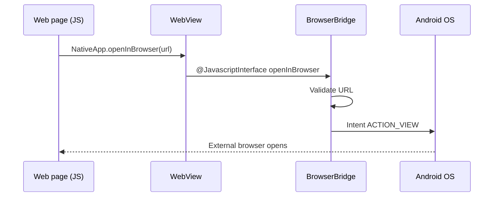

# WebViewBrowserBridge

Kotlin sample app that demonstrates secure two-way communication between a **WebView** and native Android via a JavaScript interface named `NativeApp`.

| Item | Value |
|------|--------|
| Language | Kotlin |
| Min SDK | 24 |
| Target / Compile SDK | 36 (Android 16, latest stable) |
| Application ID | `com.example.webviewbrowserbridge` |

---

## Project structure

```
WebViewBrowserBridge/
├── app/src/main/
│   ├── AndroidManifest.xml
│   ├── assets/sample_bridge.html      # Bundled demo page
│   ├── java/.../MainActivity.kt       # WebView host
│   ├── java/.../BrowserBridge.kt      # JavascriptInterface
│   └── res/layout/activity_main.xml
├── sample-html/index.html             # Hostable copy of the demo page
└── README.md
```

---

## How to run

1. Open the `WebViewBrowserBridge` folder in Android Studio (Ladybug / Koala or newer recommended).
2. Let Gradle sync (wrapper will download if needed).
3. Run on an emulator or device (API 24+).

The app loads the bundled asset page by default so both bridge buttons work immediately:

- **Open in Mobile Browser** → calls `NativeApp.openInBrowser(...)` and launches Chrome/system browser with `https://example.com` (from the asset page) or the real page URL when hosted.
- **Show Native Toast** → calls `NativeApp.showToast("Hello from WebView")`.

Filter Logcat with tag **`WebViewBridge`**.

---

## Configure the start URL

In `MainActivity.kt`:

```kotlin
private const val START_URL = "file:///android_asset/sample_bridge.html"
```

Examples:

```kotlin
// Bundled demo (default)
private const val START_URL = "file:///android_asset/sample_bridge.html"

// Any HTTPS site that uses the bridge
private const val START_URL = "https://example.com"

// Your hosted copy of sample-html/index.html
private const val START_URL = "https://your-domain.com/webview-bridge/"
```

---

## How the JavaScript bridge works

1. Native code creates a `BrowserBridge` instance and registers it on the WebView:

   ```kotlin
   webView.addJavascriptInterface(BrowserBridge(this), "NativeApp")
   ```

2. After that, JavaScript in any loaded page can call:

   ```javascript
   window.NativeApp.openInBrowser(url);
   window.NativeApp.showToast("Hello from WebView");
   ```

3. The WebView runtime marshals those calls onto a background bridge thread into the annotated Kotlin methods. Those methods then run native Android APIs (`Intent`, `Toast`, logging, validation).

4. There is no automatic “return value” channel for complex objects; prefer simple primitives/strings. To send data back to the page, evaluate JS from Kotlin with `webView.evaluateJavascript(...)`.



---

## Why `@JavascriptInterface` is required

On Android 4.2 (API 17)+, only methods annotated with `@JavascriptInterface` are exposed to JavaScript.

Without the annotation, the method is **not** callable from the page. This was introduced after a serious vulnerability where untrusted pages could reflectively access public methods on injected objects (including dangerous framework APIs). Always:

- Annotate only the methods you intend to expose
- Keep those methods small and carefully validated
- Keep ProGuard rules that preserve annotated members (`proguard-rules.pro` is included)

---

## Security considerations

| Risk | Mitigation in this sample |
|------|---------------------------|
| Untrusted page calling native code | Only expose narrow methods (`openInBrowser`, `showToast`) |
| Arbitrary URL / intent injection | Validate `http`/`https` and require a non-blank host before launching |
| JavaScript enabled globally | Necessary for the bridge; only load trusted content when possible |
| Obfuscation stripping methods | Keep rules for `@JavascriptInterface` methods |
| Cleartext traffic | `usesCleartextTraffic="false"`; prefer HTTPS pages |
| Mixed content | `MIXED_CONTENT_COMPATIBILITY_MODE` for legacy subresources |

**Recommendations for production**

- Prefer an allowlist of origins before injecting the interface (inject only after verifying `url`).
- Do not expose file I/O, reflection, or arbitrary Intent APIs.
- Treat every string from JS as hostile input.
- Consider disabling `WebView.setWebContentsDebuggingEnabled` in release builds.

---

## Using the bridge from any website

Any page loaded inside this WebView can use the bridge once `NativeApp` is injected:

```html
<script>
  function openInBrowser() {
    const url = window.location.href;

    if (window.NativeApp && window.NativeApp.openInBrowser) {
      window.NativeApp.openInBrowser(url);
    } else {
      alert("Native bridge not available.");
    }
  }

  function showNativeToast() {
    if (window.NativeApp && window.NativeApp.showToast) {
      window.NativeApp.showToast("Hello from WebView");
    } else {
      alert("Native bridge not available.");
    }
  }
</script>
```

Always feature-detect `window.NativeApp` so the same HTML still works in a normal desktop browser (with a graceful fallback).

Host `sample-html/index.html` on any static host (GitHub Pages, S3, nginx, etc.), then set `START_URL` to that HTTPS URL.

---

## Permissions

Only `android.permission.INTERNET` is declared — required for remote `http`/`https` WebView loads. Local `file:///android_asset/` pages do not need it, but keeping it allows switching `START_URL` to a remote host without further changes.

---

## Logging (tag: `WebViewBridge`)

| Event | When |
|-------|------|
| JS interface injected | After `addJavascriptInterface` |
| Page loaded | `onPageFinished` |
| `shouldOverrideUrlLoading` / `onPageStarted` / `onReceivedError` | WebViewClient |
| Progress + JS console | WebChromeClient |
| Browser launch requested / success / errors | `BrowserBridge.openInBrowser` |

---

## License

Sample code — free to use and modify.
